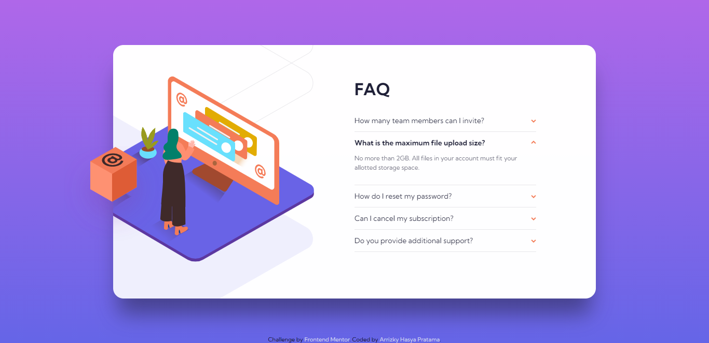

# Frontend Mentor - FAQ accordion card solution

This is a solution to the [FAQ accordion card challenge on Frontend Mentor](https://www.frontendmentor.io/challenges/faq-accordion-card-XlyjD0Oam). Frontend Mentor challenges help you improve your coding skills by building realistic projects.

## Table of contents

- [Overview](#overview)
  - [The challenge](#the-challenge)
  - [Screenshot](#screenshot)
  - [Links](#links)
- [My process](#my-process)
  - [Built with](#built-with)
  - [What I learned](#what-i-learned)
- [Useful resources](#useful-resources)
- [Install](#install)
- [Author](#author)

## Overview

### The challenge

- View the optimal layout for the component depending on their device's screen size
- See hover states for all interactive elements on the page
- Hide/Show the answer to a question when the question is clicked

### Screenshot

[📱 Mobile Version](./mobile.png)

### Links

- Solution URL: [Solution](https://github.com/arrizkyhp/faq-accordion-card-main)
- Live Site URL: [Live Site](https://arrizkyhp.github.io/faq-accordion-card-main/)

## My process

### Built with

- CSS custom properties
- Flexbox
- CSS Grid
- BEM naming
- [Sass](https://sass-lang.com/) - CSS extension
- [GulpJS](https://gulpjs.com/) - JS library
- [ReactJS](https://reactjs.org/) - JS library

### What I learned

In This challenge i learned how to make accordion with react js, i used bootstrap accordion as a reference and how to implement the stacked illustration.

Also i learned more about Accessibility on my accordion (clicked faq) i put the source below.

### Useful resources

- [ARIA HTML Tutorial - What is ARIA & Why it's Important to Use!](https://www.youtube.com/watch?v=0hqhAIjE_8I) - This helped me understand what ARIA is, which I'm using in accordion to this challenge
- [What Are ARIA Attributes?](https://www.youtube.com/watch?v=38JDscMbB4I&list=PLHj-XK_AYWQAkuqV5qkosjL9fV2_DF33W&index=1) - And This one also.
- [Bootstrap v5.0 Docs | Accordion](https://getbootstrap.com/docs/5.0/components/accordion/) - This is my accordion reference.<!--  -->

## Install

In the project directory, you can run:

### `npm start`

Runs the app in the development mode.\
Open [http://localhost:3000](http://localhost:3000) to view it in the browser.

The page will reload if you make edits.\
You will also see any lint errors in the console.

to start gulp js processing scss run:

### `gulp`

## Author

- Github - [arrizkyhp](https://github.com/arrizkyhp)
- Frontend Mentor - [@arrizkyhp](https://www.frontendmentor.io/profile/arrizkyhp)
- Twitter - [@arrizkyhp](https://twitter.com/arrizkyhp)
